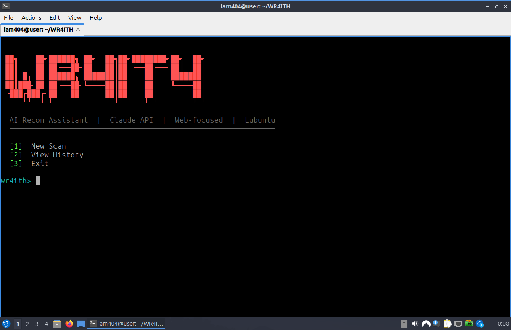

# WR4ITH
> AI-powered web recon assistant · Claude API · SQLite · Lubuntu

```
 ██╗    ██╗██████╗ ██╗  ██╗██╗████████╗██╗  ██╗
 ██║    ██║██╔══██╗██║  ██║██║╚══██╔══╝██║  ██║
 ██║ █╗ ██║██████╔╝███████║██║   ██║   ███████║
 ██║███╗██║██╔══██╗╚════██║██║   ██║   ╚════██║
 ╚███╔███╔╝██║  ██║     ██║██║   ██║        ██║
  ╚══╝╚══╝ ╚═╝  ╚═╝     ╚═╝╚═╝   ╚═╝        ╚═╝
```

Forked from [METATRON](https://github.com/sooryathejas/METATRON) by sooryathejas (MIT License).  
WR4ITH replaces the local Ollama LLM with the Claude API, swaps MariaDB for SQLite, adds a dedicated web recon module, and is built to run clean on Lubuntu/Ubuntu.

---

## What it does

You give it a target (IP or domain). It runs recon, feeds everything to Claude, and gets back a structured vulnerability report saved to a local database.

**Two scan modes:**
- **Active** — nmap, whois, whatweb, curl, dig, nikto + full web checks + path probing
- **Passive** — headers, JS analysis, DNS, robots.txt only (quieter footprint)

**Web recon module (new in WR4ITH):**
- Security headers deep check (HSTS, CSP, CORS, X-Frame-Options, cookies...)
- robots.txt + sitemap.xml parsing — reveals hidden endpoints
- JS file harvesting + endpoint/secret extraction (API keys, bearer tokens, paths)
- Common path probing (/.env, /admin, /api/docs, /.git/HEAD...)
- Tech fingerprinting (WordPress, Laravel, Django, React, Cloudflare...)

**Claude agentic loop:**  
Claude can request additional tool runs mid-analysis if it needs more data — same architecture as METATRON, just with Claude as the brain.

---

## Stack

| Component   | Tech                        |
|-------------|-----------------------------|
| Language    | Python 3                    |
| AI          | Claude Sonnet (Anthropic API) |
| Database    | SQLite (zero setup)         |
| Network tools | nmap, whois, curl, dig, nikto, whatweb |
| Web recon   | requests, BeautifulSoup     |
| Search      | DuckDuckGo (no API key)     |
| OS          | Lubuntu / Ubuntu (Debian)   |

---

## Installation

**1. Clone**
```bash
git clone git@github.com:YOUR_USERNAME/WR4ITH.git
cd WR4ITH
```

**2. Install Python deps**
```bash
sudo apt install python3-pip -y
pip3 install -r requirements.txt --break-system-packages
```

**3. Install recon tools**
```bash
sudo apt install nmap whois curl dnsutils nikto whatweb -y
```

**4. Set your Anthropic API key**
```bash
echo "sk-ant-your-key-here" > ~/.wr4ith_key
chmod 600 ~/.wr4ith_key
```
Or set as environment variable:
```bash
export ANTHROPIC_API_KEY=sk-ant-your-key-here
```
Or just run the tool — it'll prompt you on first launch if no key is found.

**5. Run**
```bash
python3 wr4ith.py
```

---

## Usage

```
wr4ith> 1        → New scan
wr4ith> 2        → View scan history
wr4ith> 3        → Exit
```

**New scan flow:**
1. Enter target IP or domain
2. Choose Active or Passive mode
3. Select which network tools to run (or skip for web-only)
4. WR4ITH runs recon and sends everything to Claude
5. Claude analyzes, identifies vulnerabilities, suggests fixes
6. Results saved to local `wr4ith.db`
7. Option to export report as `.txt`

**View history:**  
Browse past scans, view full reports, edit/delete entries, export any session.

---

## File structure

```
WR4ITH/
├── wr4ith.py        ← main shell + menus
├── llm.py           ← Claude API brain + agentic loop
├── webtools.py      ← web recon (headers, JS, paths, fingerprint)
├── tools.py         ← network recon (nmap, whois, dig, nikto...)
├── search.py        ← DuckDuckGo + CVE lookup
├── db.py            ← SQLite backend
├── export.py        ← .txt report export
├── requirements.txt
└── wr4ith.db        ← created on first run (gitignored)
```

---

## Legal

**Only use WR4ITH on systems you own or have explicit written permission to test.**  
Unauthorized scanning is illegal. The author is not responsible for misuse.

This tool is intended for:
- Security testing of your own projects
- Authorized penetration testing engagements
- Bug bounty programs where scanning is explicitly permitted
- Learning and educational purposes

---

## Screenshots



---

## Credits

- Original METATRON architecture by [sooryathejas](https://github.com/sooryathejas/METATRON) — MIT License
- Claude API by [Anthropic](https://anthropic.com)
